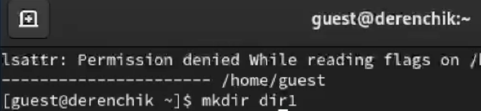

---
## Front matter
lang: ru-RU
title: Лабораторная работа 
subtitle: Дискреционное разграничение прав в Linux. Основные атрибуты
author:
  - Панченко Д. Д.
institute:
  - Российский университет дружбы народов, Москва, Россия
date: 2 марта 2024

## i18n babel
babel-lang: russian
babel-otherlangs: english

## Formatting pdf
toc: false
toc-title: Содержание
slide_level: 2
aspectratio: 169
section-titles: true
theme: metropolis
header-includes:
 - \metroset{progressbar=frametitle,sectionpage=progressbar,numbering=fraction}
 - '\makeatletter'
 - '\beamer@ignorenonframefalse'
 - '\makeatother'
---

# Информация

## Докладчик

  * Панченко Денис Дмитриевич
  * Студент 2 курса факультета физико-математических наук.
  * Российский университет дружбы народов
  * [derenchikde@gmail.com](mailto:derenchikde@gmail.com)

## Цели и задачи

Получение практических навыков работы в консоли с атрибутами файлов, закрепление теоретических основ дискреционного разграничения доступа в современных системах с открытым кодом на базе ОС Linux.

## Задание

Получить практические навыки работы в консоли с атрибутами файлов.

# Выполнение лабораторной работы

## Создаем учётную запись пользователя.

## Задаем пароль для пользователя.

## Определяем директорию, в которой находимся.

## Уточняем имя пользователя.

## Уточняем имя пользователя, его группу, а также группы, куда входит пользователь.

## Просмотрим файл /etc/passwd.

## Найдем в нём свою учётную запись.

## Определяем существующие в системе директории.

## Проверяем, какие расширенные атрибуты установлены на поддиректориях.

## Создаем в домашней директории поддиректорию.

## Определяем права доступа.

## Снимаем с директории dir1 все атрибуты.

## Проверяем правильность выполнения.

## Попытаемся создать в директории dir1 файл file1. Ничего не вышло, так как мы сняли все права доступа.

## Проверим действительно ли не создался файл.

# Вывод

Я получил практические навыки работы в консоли с атрибутами файлов, закрепил теоретические основы дискреционного разграничения доступа в современных системах с открытым кодом на базе ОС Linux.
