---
## Front matter
title: "Лабораторная работа №2"
subtitle: "Дискреционное разграничение прав в Linux. Основные атрибуты"
author: "Панченко Денис Дмитриевич"

## Generic otions
lang: ru-RU
toc-title: "Содержание"

## Bibliography
bibliography: bib/cite.bib
csl: pandoc/csl/gost-r-7-0-5-2008-numeric.csl

## Pdf output format
toc: true # Table of contents
toc-depth: 2
lof: false # List of figures
lot: false # List of tables
fontsize: 12pt
linestretch: 1.5
papersize: a4
documentclass: scrreprt
## I18n polyglossia
polyglossia-lang:
  name: russian
  options:
	- spelling=modern
	- babelshorthands=true
polyglossia-otherlangs:
  name: english
## I18n babel
babel-lang: russian
babel-otherlangs: english
## Fonts
mainfont: PT Serif
romanfont: PT Serif
sansfont: PT Sans
monofont: PT Mono
mainfontoptions: Ligatures=TeX
romanfontoptions: Ligatures=TeX
sansfontoptions: Ligatures=TeX,Scale=MatchLowercase
monofontoptions: Scale=MatchLowercase,Scale=0.9
## Biblatex
biblatex: true
biblio-style: "gost-numeric"
biblatexoptions:
  - parentracker=true
  - backend=biber
  - hyperref=auto
  - language=auto
  - autolang=other*
  - citestyle=gost-numeric
## Pandoc-crossref LaTeX customization
figureTitle: "Рис."
tableTitle: "Таблица"
listingTitle: "Листинг"
lofTitle: "Список иллюстраций"
lotTitle: "Список таблиц"
lolTitle: "Листинги"
## Misc options
indent: true
header-includes:
  - \usepackage{indentfirst}
  - \usepackage{float} # keep figures where there are in the text
  - \floatplacement{figure}{H} # keep figures where there are in the text
---

# Цель работы

Получение практических навыков работы в консоли с атрибутами файлов, закрепление теоретических основ дискреционного разграничения доступа в современных системах с открытым кодом на базе ОС Linux.

# Задание

Получить практические навыки работы в консоли с атрибутами файлов.

# Выполнение лабораторной работы

Создаем учётную запись пользователя (рис. 001).

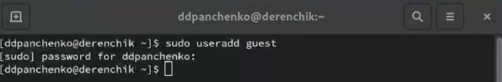{#fig:001 width=70%}

Задаем пароль для пользователя (рис. 002).

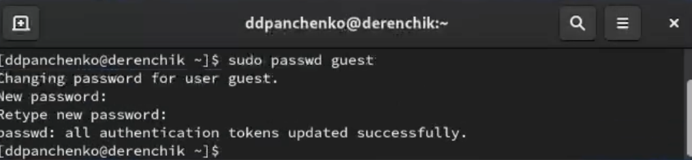{#fig:002 width=70%}

Определяем директорию, в которой находимся (рис. 003).

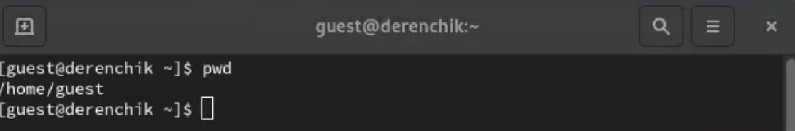{#fig:003 width=70%}

Уточняем имя пользователя (рис. 004).

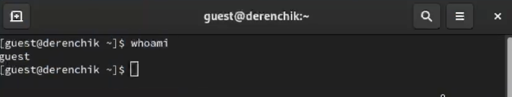{#fig:004 width=70%}

Уточняем имя пользователя, его группу, а также группы, куда входит пользователь (рис. 005).

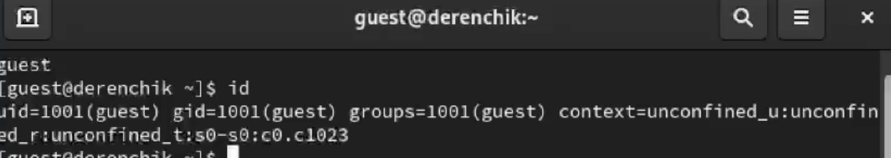{#fig:005 width=70%}

Просмотрим файл /etc/passwd (рис. 006).

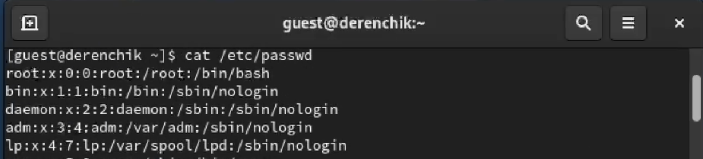{#fig:006 width=70%}

Найдем в нём свою учётную запись (рис. 007).

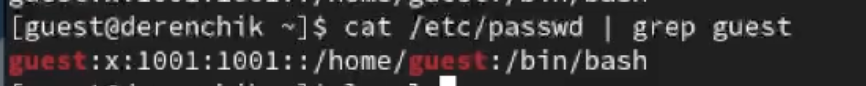{#fig:007 width=70%}

Определяем существующие в системе директории (рис. 008).

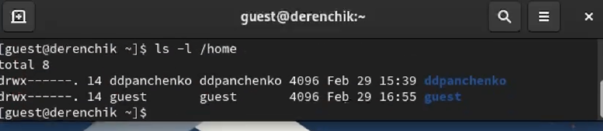{#fig:008 width=70%}

Проверяем, какие расширенные атрибуты установлены на поддиректориях (рис. 009).

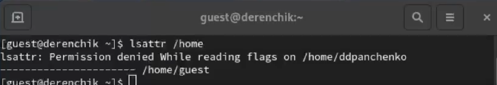{#fig:009 width=70%}

Создаем в домашней директории поддиректорию (рис. 010).

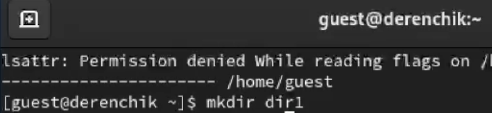{#fig:010 width=70%}

Определяем права доступа (рис. 011 - 012).

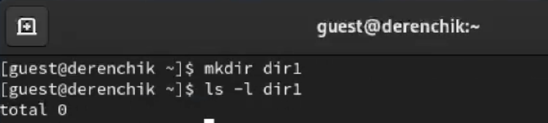{#fig:011 width=70%}

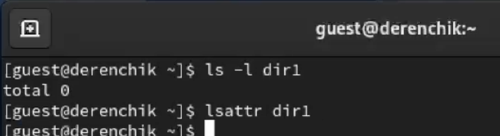{#fig:012 width=70%}

Снимаем с директории dir1 все атрибуты (рис. 013).

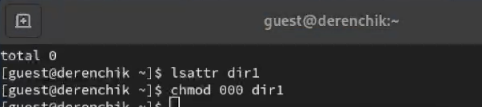{#fig:013 width=70%}

Проверяем правильность выполнения (рис. 014).

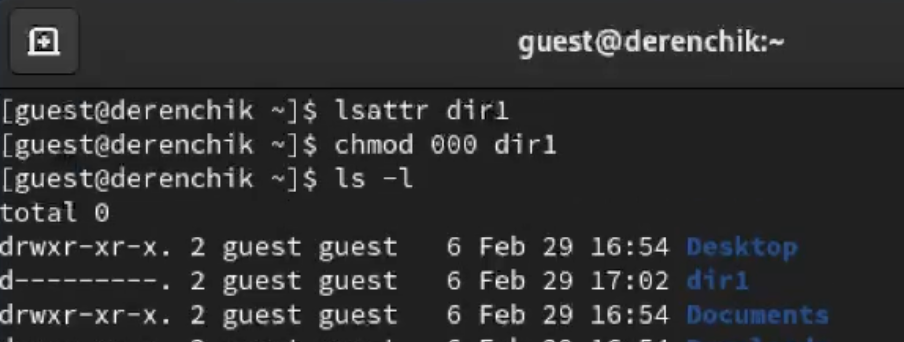{#fig:014 width=70%}

Попытаемся создать в директории dir1 файл file1. Ничего не вышло, так как мы сняли все права доступа (рис. 015).

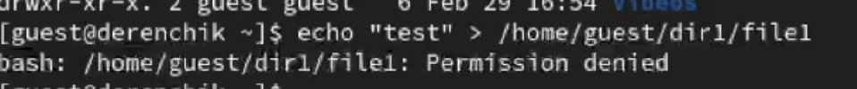{#fig:015 width=70%}

Проверим действительно ли не создался файл (рис. 016).

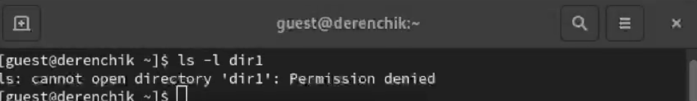{#fig:016 width=70%}

# Вывод

Я получил практические навыки работы в консоли с атрибутами файлов, закрепил теоретические основы дискреционного разграничения доступа в современных системах с открытым кодом на базе ОС Linux.
