---
## Front matter
lang: ru-RU
title: Лабораторная работа 
subtitle: Дискреционное разграничение прав в Linux. Два пользователя
author:
  - Панченко Д. Д.
institute:
  - Российский университет дружбы народов, Москва, Россия
date: 14 марта 2024

## i18n babel
babel-lang: russian
babel-otherlangs: english

## Formatting pdf
toc: false
toc-title: Содержание
slide_level: 2
aspectratio: 169
section-titles: true
theme: metropolis
header-includes:
 - \metroset{progressbar=frametitle,sectionpage=progressbar,numbering=fraction}
 - '\makeatletter'
 - '\beamer@ignorenonframefalse'
 - '\makeatother'
---

# Информация

## Докладчик

  * Панченко Денис Дмитриевич
  * Студент 2 курса факультета физико-математических наук.
  * Российский университет дружбы народов
  * [derenchikde@gmail.com](mailto:derenchikde@gmail.com)

## Цели и задачи

Получение практических навыков работы в консоли с атрибутами файлов для групп пользователей.

## Задание

Получить практические навыки работы в консоли с атрибутами файлов для групп пользователей.

# Выполнение лабораторной работы

## Создаем учётную запись пользователя guest.

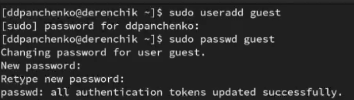

## Создаем учётную запись пользователя guest2.

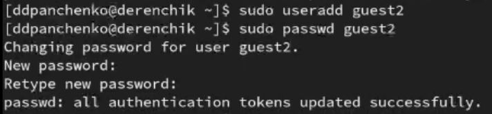

## Добавляем пользователя guest2 в группу guest.

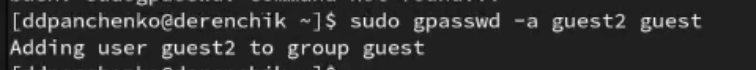

## Осуществляем вход в систему от двух пользователей на двух разных консолях.

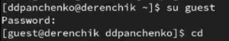

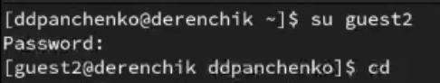

## Командой pwd определяем директорию, в которой мы находимся.

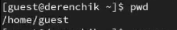

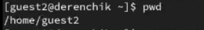

## Определяем в какие группы входят пользователи.

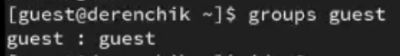

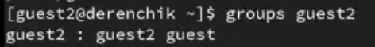

## Определяем в какие группы входят пользователи с помощью других команды

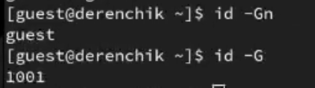

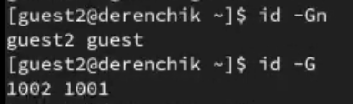

## Просмотрим содержимое файла group.

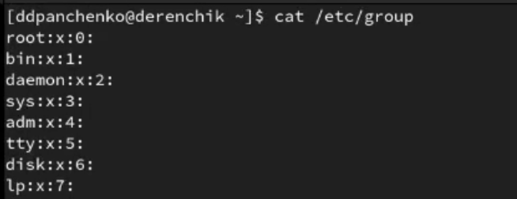

## От имени пользователя guest2 выполним регистрацию пользователя guest2 в группе guest.

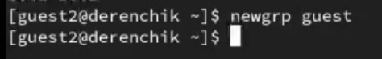

## Разрешим все действия для пользователей группы.

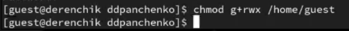

## Снимем с директории /home/guest/dir1 все атрибуты.

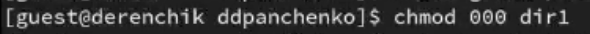

# Вывод

Я получил практические навыки работы в консоли с атрибутами файлов для групп пользователей.
