---
## Front matter
title: "Лабораторная работа 3"
subtitle: "Дискреционное разграничение прав в Linux. Два пользователя"
author: "Панченко Денис Дмитриевич"

## Generic otions
lang: ru-RU
toc-title: "Содержание"

## Bibliography
bibliography: bib/cite.bib
csl: pandoc/csl/gost-r-7-0-5-2008-numeric.csl

## Pdf output format
toc: true # Table of contents
toc-depth: 2
lof: false # List of figures
lot: false # List of tables
fontsize: 12pt
linestretch: 1.5
papersize: a4
documentclass: scrreprt
## I18n polyglossia
polyglossia-lang:
  name: russian
  options:
	- spelling=modern
	- babelshorthands=true
polyglossia-otherlangs:
  name: english
## I18n babel
babel-lang: russian
babel-otherlangs: english
## Fonts
mainfont: PT Serif
romanfont: PT Serif
sansfont: PT Sans
monofont: PT Mono
mainfontoptions: Ligatures=TeX
romanfontoptions: Ligatures=TeX
sansfontoptions: Ligatures=TeX,Scale=MatchLowercase
monofontoptions: Scale=MatchLowercase,Scale=0.9
## Biblatex
biblatex: true
biblio-style: "gost-numeric"
biblatexoptions:
  - parentracker=true
  - backend=biber
  - hyperref=auto
  - language=auto
  - autolang=other*
  - citestyle=gost-numeric
## Pandoc-crossref LaTeX customization
figureTitle: "Рис."
tableTitle: "Таблица"
listingTitle: "Листинг"
lofTitle: "Список иллюстраций"
lotTitle: "Список таблиц"
lolTitle: "Листинги"
## Misc options
indent: true
header-includes:
  - \usepackage{indentfirst}
  - \usepackage{float} # keep figures where there are in the text
  - \floatplacement{figure}{H} # keep figures where there are in the text
---

# Цель работы

Получение практических навыков работы в консоли с атрибутами файлов для групп пользователей.

# Задание

Получить практические навыки работы в консоли с атрибутами файлов для групп пользователей.

# Выполнение лабораторной работы

Создаем учётную запись пользователя guest (рис. 1).

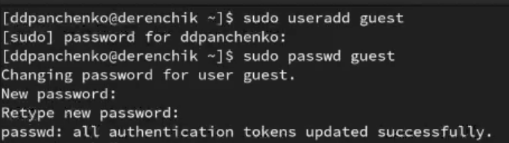{#fig:001 width=70%}

Создаем учётную запись пользователя guest2 (рис. 2).

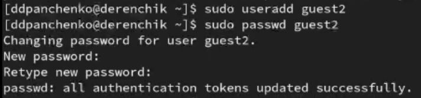{#fig:002 width=70%}

Добавляем пользователя guest2 в группу guest (рис. 3).

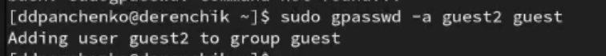{#fig:003 width=70%}

Осуществляем вход в систему от двух пользователей на двух разных консолях (рис. 4 - 5).

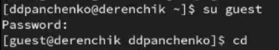{#fig:004 width=70%}

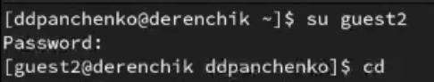{#fig:005 width=70%}

Командой pwd определяем директорию, в которой мы находимся (рис. 6 - 7).

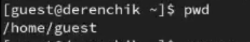{#fig:006 width=70%}

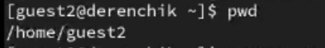{#fig:007 width=70%}

Определяем в какие группы входят пользователи (рис. 8 - 9).

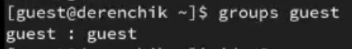{#fig:008 width=70%}

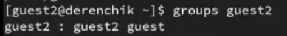{#fig:009 width=70%}

Определяем в какие группы входят пользователи с помощью других команд (рис. 10 - 11).

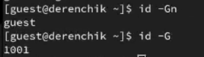{#fig:010 width=70%}

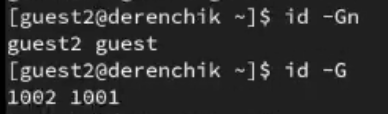{#fig:011 width=70%}

Просмотрим содержимое файла group (рис. 12).

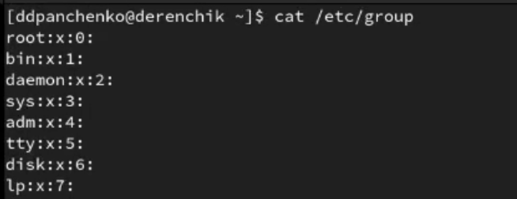{#fig:012 width=70%}

От имени пользователя guest2 выполним регистрацию пользователя
guest2 в группе guest (рис. 13).

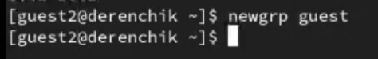{#fig:013 width=70%}

Разрешим все действия для пользователей группы (рис. 14).

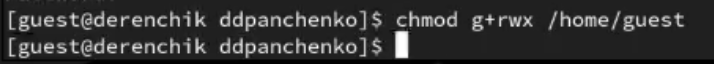{#fig:014 width=70%}

Снимем с директории /home/guest/dir1 все атрибуты (рис. 15).

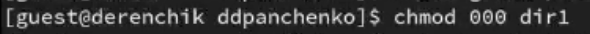{#fig:015 width=70%}

# Вывод

Я получил практические навыки работы в консоли с атрибутами файлов для групп пользователей.
