---
## Front matter
lang: ru-RU
title: Лабораторная работа 
subtitle: Дискреционное разграничение прав в Linux. Расширенные атрибуты
author:
  - Панченко Д. Д.
institute:
  - Российский университет дружбы народов, Москва, Россия
date: 23 марта 2024

## i18n babel
babel-lang: russian
babel-otherlangs: english

## Formatting pdf
toc: false
toc-title: Содержание
slide_level: 2
aspectratio: 169
section-titles: true
theme: metropolis
header-includes:
 - \metroset{progressbar=frametitle,sectionpage=progressbar,numbering=fraction}
 - '\makeatletter'
 - '\beamer@ignorenonframefalse'
 - '\makeatother'
---

# Информация

## Докладчик

  * Панченко Денис Дмитриевич
  * Студент 2 курса факультета физико-математических наук.
  * Российский университет дружбы народов
  * [derenchikde@gmail.com](mailto:derenchikde@gmail.com)

## Цели и задачи

Получение практических навыков работы в консоли с расширенными атрибутами файлов.

## Задание

Получить практические навыки работы в консоли с расширенными атрибутами файлов.

# Выполнение лабораторной работы

## От имени пользователя guest определите расширенные атрибуты файла.

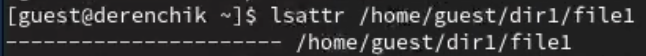

## Установим на файл права, разрешающие чтение и запись для владельца файла.

## Попробуем установить на файл расширенный атрибут a от имени пользователя guest.
Не вышло.

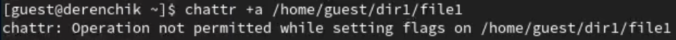

## Зайдем в другую консоль с правами администратора и попробуем установить расширенный атрибут a на файл.

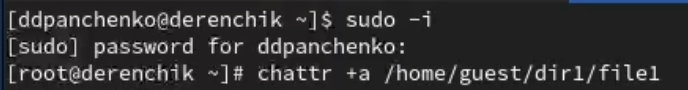

## От пользователя guest проверим правильность установления атрибута.

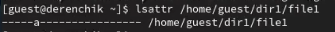

## Выполним дозапись в файл слова «test» и выполним чтение файла.

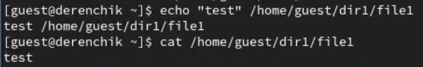

## Попробуем удалить файл.
Удалить файл не вышло.

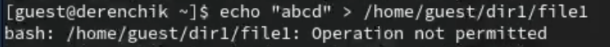

## Попробуем установить на файл права, запрещающие чтение и запись для владельца файла.
Не получилось.

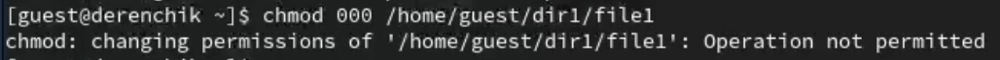

## Снимем расширенный атрибут a с файла от имени суперпользователя.

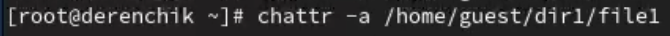

## Повторим операции, которые нам ранее не удавалось выполнить.

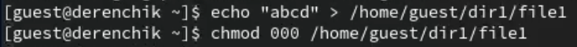

## Повторим наши действия по шагам, заменив атрибут «a» атрибутом «i»
Выполнение команд с атрибутом "i" не отличается от выполнения команд с атрибутом "a".

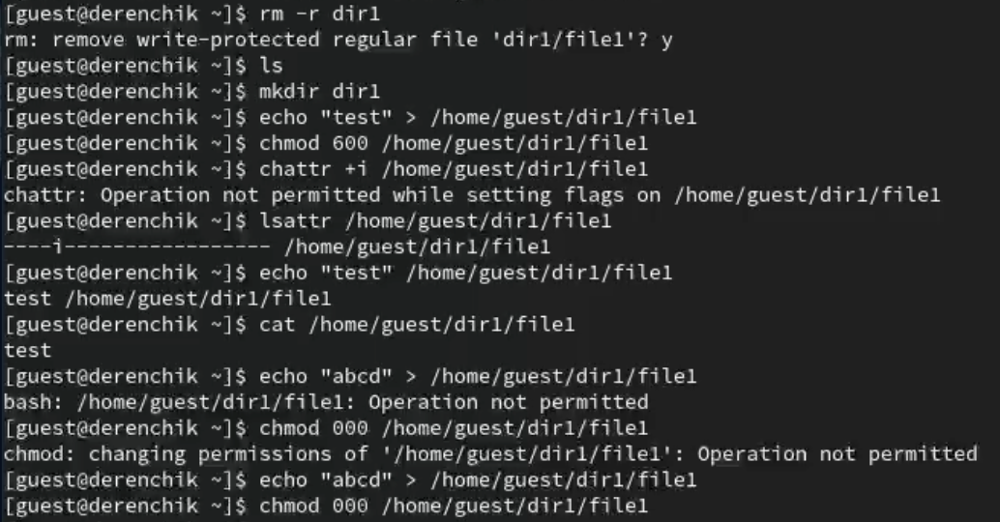

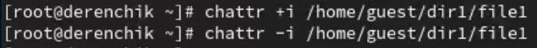

# Вывод

В результате выполнения работы я повысили свои навыки использования интерфейса командой строки, познакомился на примерах с тем, как используются основные и расширенные атрибуты при разграничении доступа. Имел возможность связать теорию дискреционного разделения доступа (дискреционная политика безопасности) с её реализацией на практике в ОС Linux. Опробовал действие на практике расширенных атрибутов «а» и «i».
