---
## Front matter
lang: ru-RU
title: Лабораторная работа 6
subtitle: Мандатное разграничение прав в Linux
author:
  - Панченко Д. Д.
institute:
  - Российский университет дружбы народов, Москва, Россия
date: 24 апреля 2024

## i18n babel
babel-lang: russian
babel-otherlangs: english

## Formatting pdf
toc: false
toc-title: Содержание
slide_level: 2
aspectratio: 169
section-titles: true
theme: metropolis
header-includes:
 - \metroset{progressbar=frametitle,sectionpage=progressbar,numbering=fraction}
 - '\makeatletter'
 - '\beamer@ignorenonframefalse'
 - '\makeatother'
---

# Информация

## Докладчик

  * Панченко Денис Дмитриевич
  * Студент 2 курса факультета физико-математических наук.
  * Российский университет дружбы народов
  * [derenchikde@gmail.com](mailto:derenchikde@gmail.com)

## Цели и задачи

* Цель:
Развить навыки администрирования ОС Linux. Получить первое практическое знакомство с технологией SELinux. Проверить работу SELinx на практике совместно с веб-сервером Apache

* Задачи:
  * Развить навыки администрирования ОС Linux.
  * Получить первое практическое знакомство с технологией SELinux.
  * Проверить работу SELinx.

# Выполнение лабораторной работы

## Выполнение лабораторной работы

1) Убедимся, что SELinux работает в режиме enforcing политики targeted.

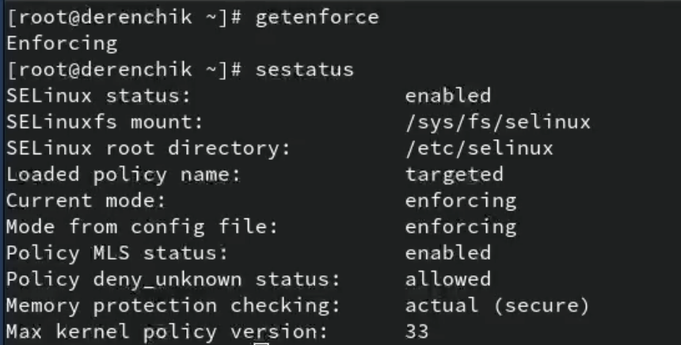{width=70%}

## Выполнение лабораторной работы

2) Обратимся к веб-серверу, запущенному на компьютере и после запустим его.

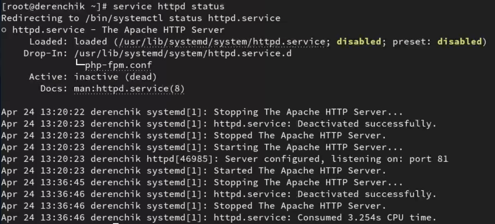{width=55%}

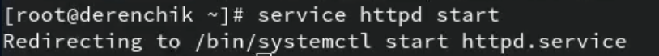{width=60%}

## Выполнение лабораторной работы

3) Найдем веб-сервер Apache в списке процессов.

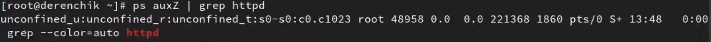

## Выполнение лабораторной работы

4) Посмотрим текущее состояние переключателей SELinux для Apach.

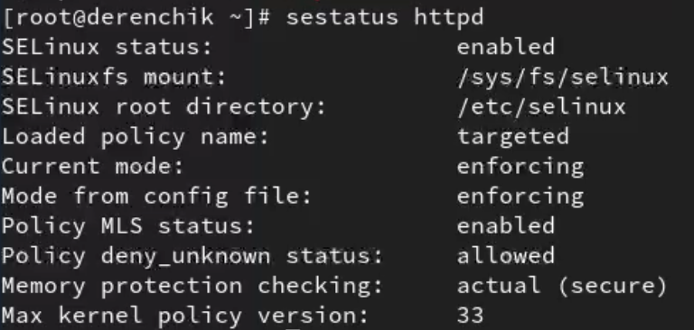{width=70%}

## Выполнение лабораторной работы

5) Посмотрим статистику по политике.

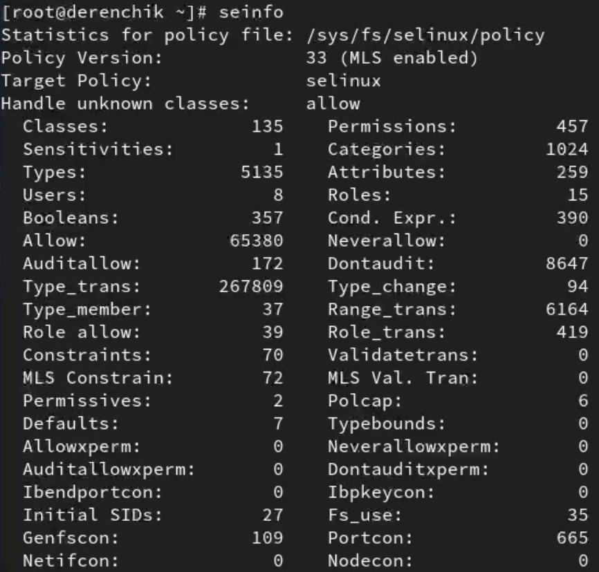{width=40%}

## Выполнение лабораторной работы

6) Определим тип файлов и поддиректорий, находящихся в директории /var/www.

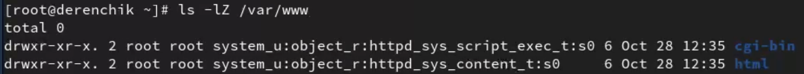

## Выполнение лабораторной работы

7) Определим тип файлов, находящихся в директории /var/www/html.

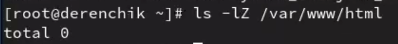

## Выполнение лабораторной работы

8) Создадим html-файл.

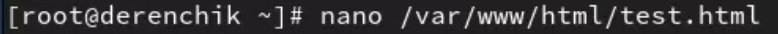

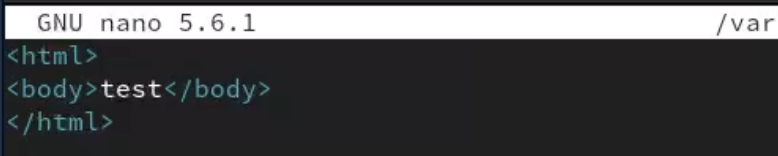

## Выполнение лабораторной работы

9) Обратимся к файлу через веб-сервер.

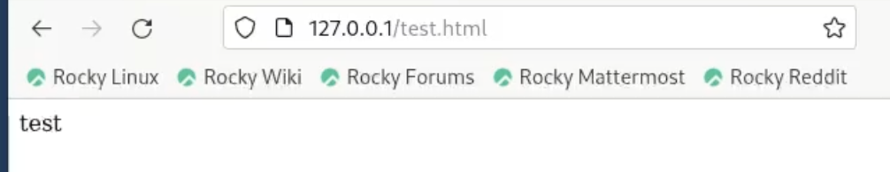

## Выполнение лабораторной работы

10) Проверим контекст файла.

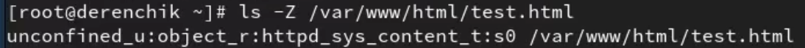

## Выполнение лабораторной работы

11) Изменим контекст файла и проверим это.

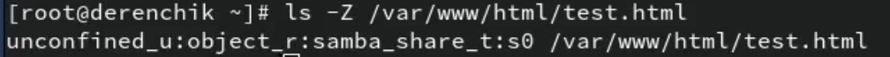

## Выполнение лабораторной работы

12) Попробуем ещё раз получить доступ к файлу через веб-сервер.
Не получилось.

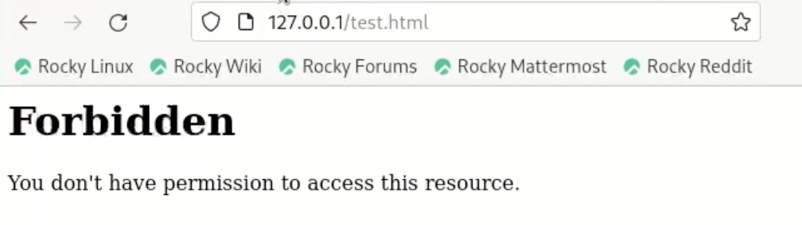

## Выполнение лабораторной работы

13) Проанализируем ситуацию.

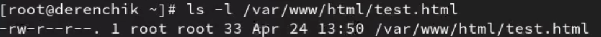{width=70%}

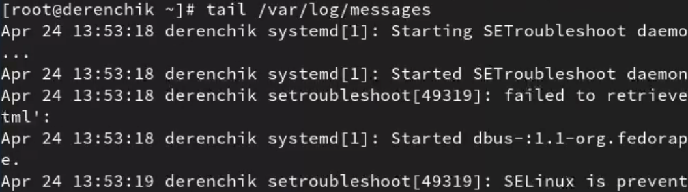{width=70%}

## Выполнение лабораторной работы

14) Попробуем запустить веб-сервер Apache на прослушивание ТСР-порта 81.

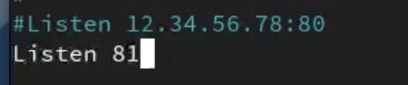

## Выполнение лабораторной работы

15) Выполним перезапуск веб-сервера Apache.
Произошел сбой.

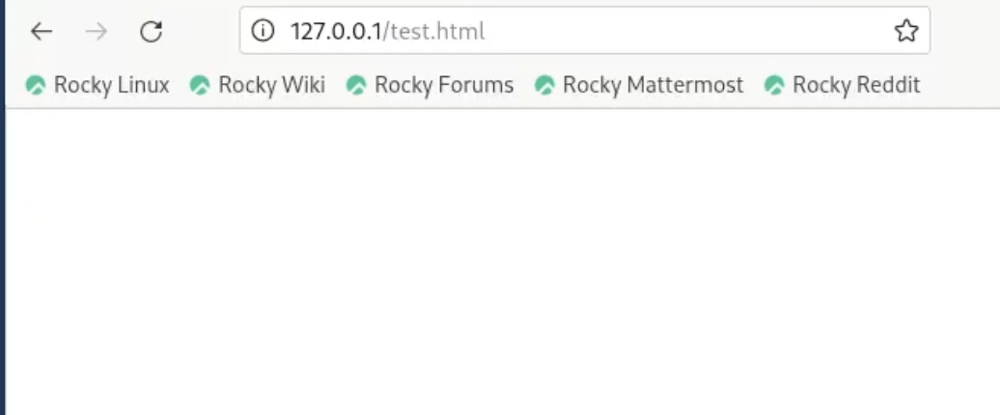

## Выполнение лабораторной работы

16) Проанализируем лог-файлы.

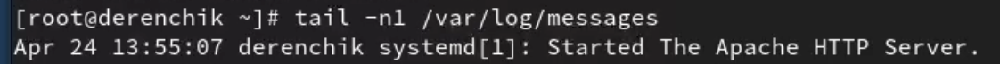

## Выполнение лабораторной работы

17) Выполним команду и проверку.

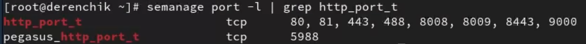

## Выполнение лабораторной работы

18) Попробуем запустить веб-сервер Apache ещё раз.
Получилось.

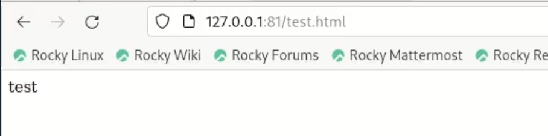

## Выполнение лабораторной работы

19) Вернем контекст httpd_sys_cоntent__t к файлу и попробуем получить доступ к веб-серверу.

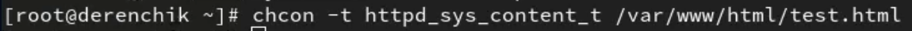{width=70%}

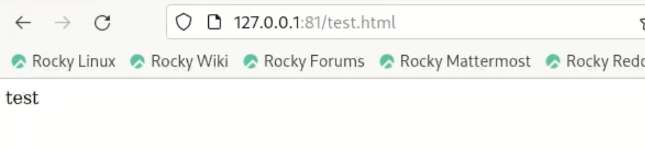{width=70%}

## Выполнение лабораторной работы

20) Исправим обратно конфигурационный файл apache.

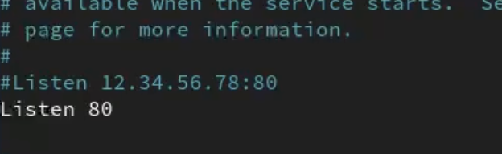

## Выполнение лабораторной работы

21) Удалим привязку http_port_t к 81 порту.

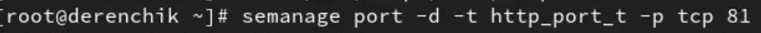

## Выполнение лабораторной работы

22) Удалим файл /var/www/html/test.html.

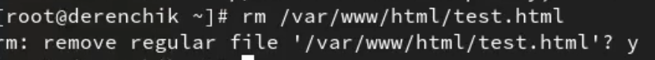

# Вывод

Я развил навыки администрирования ОС Linux, получил первое практическое знакомство с технологией SELinux и проверил работу SELinx на практике совместно с веб-сервером Apache.
