---
## Front matter
title: "Лабораторная работа №6"
subtitle: "Мандатное разграничение прав в Linux"
author: "Панченко Денис Дмитриевич"

## Generic otions
lang: ru-RU
toc-title: "Содержание"

## Bibliography
bibliography: bib/cite.bib
csl: pandoc/csl/gost-r-7-0-5-2008-numeric.csl

## Pdf output format
toc: true # Table of contents
toc-depth: 2
lof: false # List of figures
lot: false # List of tables
fontsize: 12pt
linestretch: 1.5
papersize: a4
documentclass: scrreprt
## I18n polyglossia
polyglossia-lang:
  name: russian
  options:
	- spelling=modern
	- babelshorthands=true
polyglossia-otherlangs:
  name: english
## I18n babel
babel-lang: russian
babel-otherlangs: english
## Fonts
mainfont: PT Serif
romanfont: PT Serif
sansfont: PT Sans
monofont: PT Mono
mainfontoptions: Ligatures=TeX
romanfontoptions: Ligatures=TeX
sansfontoptions: Ligatures=TeX,Scale=MatchLowercase
monofontoptions: Scale=MatchLowercase,Scale=0.9
## Biblatex
biblatex: true
biblio-style: "gost-numeric"
biblatexoptions:
  - parentracker=true
  - backend=biber
  - hyperref=auto
  - language=auto
  - autolang=other*
  - citestyle=gost-numeric
## Pandoc-crossref LaTeX customization
figureTitle: "Рис."
tableTitle: "Таблица"
listingTitle: "Листинг"
lofTitle: "Список иллюстраций"
lotTitle: "Список таблиц"
lolTitle: "Листинги"
## Misc options
indent: true
header-includes:
  - \usepackage{indentfirst}
  - \usepackage{float} # keep figures where there are in the text
  - \floatplacement{figure}{H} # keep figures where there are in the text
---

# Цель работы

Развить навыки администрирования ОС Linux. Получить первое практическое знакомство с технологией SELinux. Проверить работу SELinx на практике совместно с веб-сервером Apache

# Задачи

* Развить навыки администрирования ОС Linux.
* Получить первое практическое знакомство с технологией SELinux.
* Проверить работу SELinx.

# Выполнение лабораторной работы

1) Убедимся, что SELinux работает в режиме enforcing политики targeted (рис. [-@fig:001]).

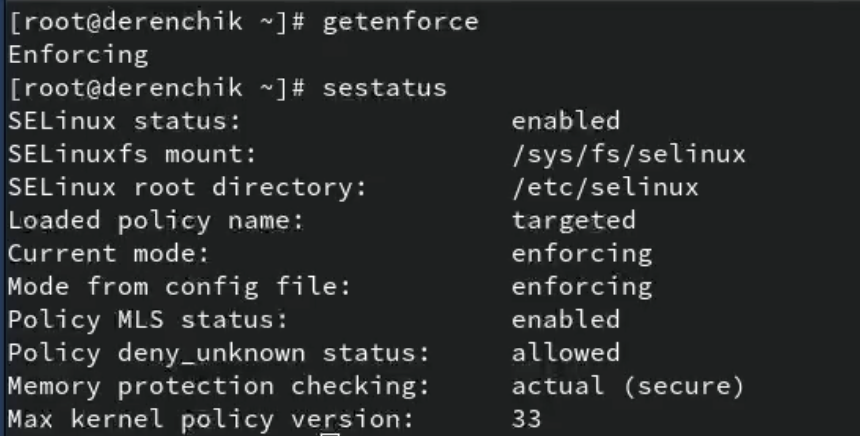{#fig:001 width=70%}

2) Обратимся к веб-серверу, запущенному на компьютере и после запустим его (рис. [-@fig:002] - [-@fig:003]).

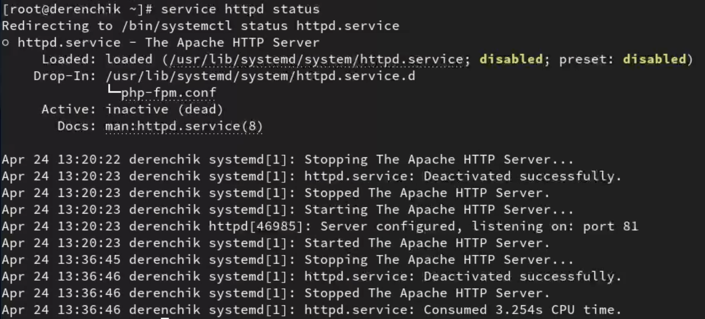{#fig:002 width=70%}

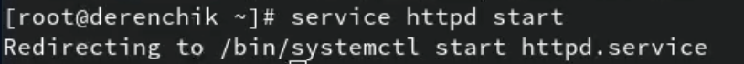{#fig:003 width=70%}

3) Найдем веб-сервер Apache в списке процессов (рис. [-@fig:004]).

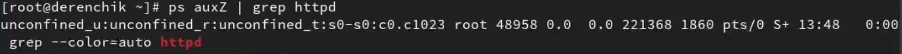{#fig:004 width=70%}

4) Посмотрим текущее состояние переключателей SELinux для Apach (рис. [-@fig:005]).

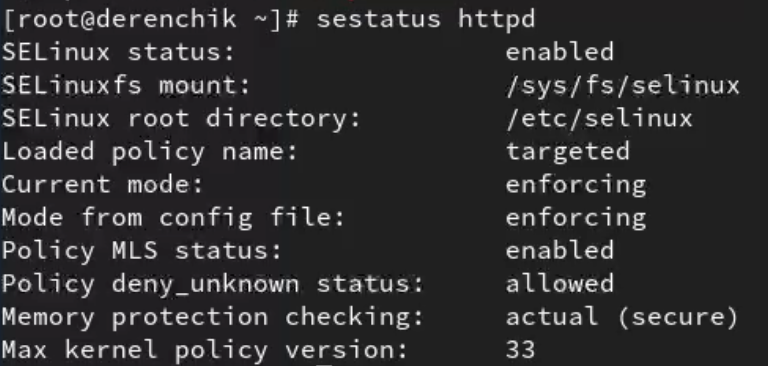{#fig:005 width=70%}

5) Посмотрим статистику по политике (рис. [-@fig:006]).

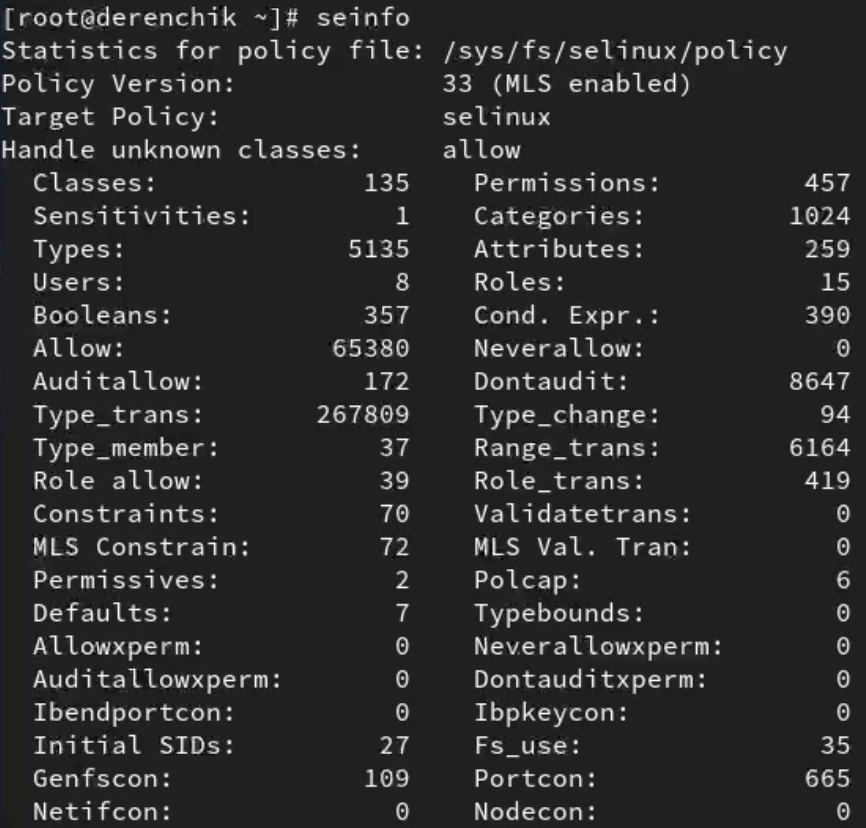{#fig:006 width=70%}

6) Определим тип файлов и поддиректорий, находящихся в директории /var/www (рис. [-@fig:007]).

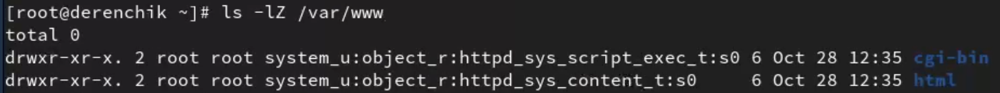{#fig:007 width=70%}

7) Определим тип файлов, находящихся в директории /var/www/html (рис. [-@fig:008]).

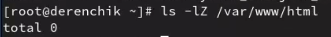{#fig:008 width=70%}

8) Создадим html-файл (рис. [-@fig:009] - [-@fig:010]).

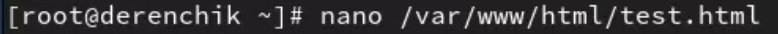{#fig:009 width=70%}

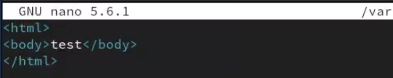{#fig:010 width=70%}

9) Обратимся к файлу через веб-сервер (рис. [-@fig:011]).

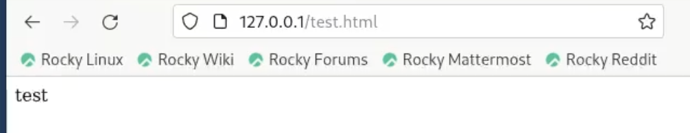{#fig:011 width=70%}

10) Проверим контекст файла (рис. [-@fig:012]).

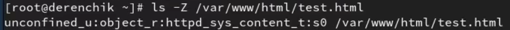{#fig:012 width=70%}

11) Изменим контекст файла и проверим это (рис. [-@fig:013] - [-@fig:014]).

{#fig:013 width=70%}

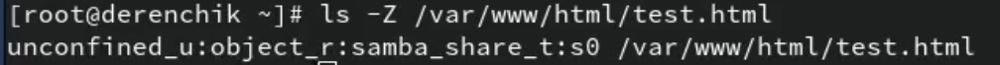{#fig:014 width=70%}

12) Попробуем ещё раз получить доступ к файлу через веб-сервер (рис. [-@fig:015]).
Не получилось.

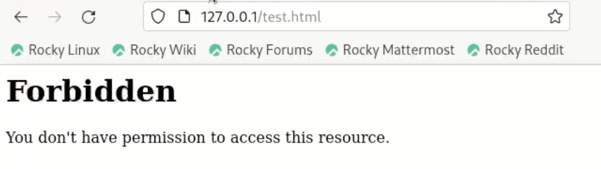{#fig:015 width=70%}

13) Проанализируем ситуацию (рис. [-@fig:016] - [-@fig:017]).

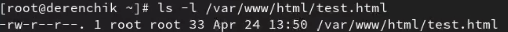{#fig:016 width=70%}

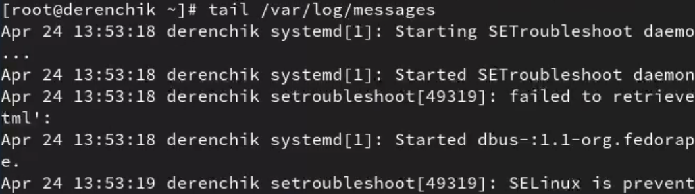{#fig:017 width=70%}

14) Попробуем запустить веб-сервер Apache на прослушивание ТСР-порта 81 (рис. [-@fig:018] - [-@fig:019]).

{#fig:018 width=70%}

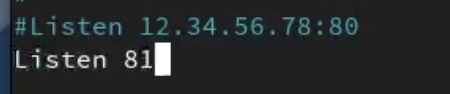{#fig:019 width=70%}

15) Выполним перезапуск веб-сервера Apache (рис. [-@fig:020]).
Произошел сбой.

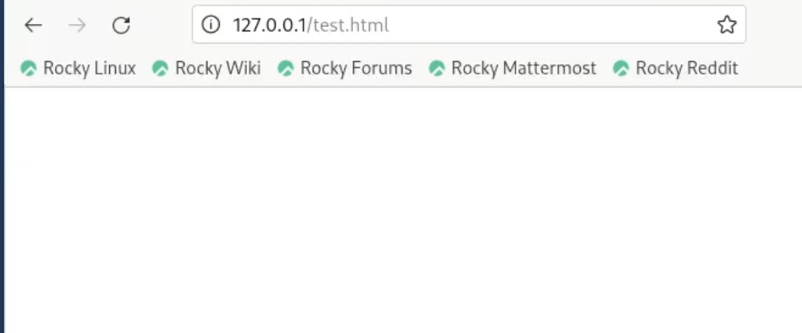{#fig:020 width=70%}

16) Проанализируем лог-файлы (рис. [-@fig:021]).

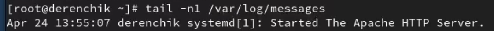{#fig:021 width=70%}

17) Выполним команду и проверку (рис. [-@fig:022] - [-@fig:023]).

{#fig:022 width=70%}

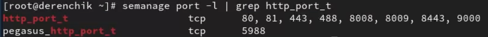{#fig:023 width=70%}

18) Попробуем запустить веб-сервер Apache ещё раз (рис. [-@fig:024]).
Получилось.

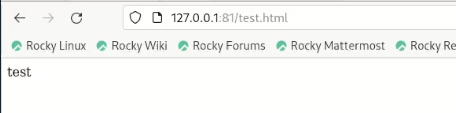{#fig:024 width=70%}

19) Вернем контекст httpd_sys_cоntent__t к файлу и попробуем получить доступ к веб-серверу (рис. [-@fig:025] - [-@fig:026]).

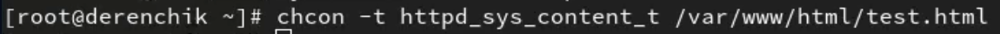{#fig:025 width=70%}

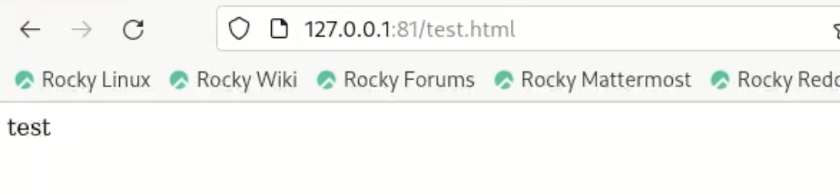{#fig:026 width=70%}

20) Исправим обратно конфигурационный файл apache (рис. [-@fig:027] - [-@fig:028]).

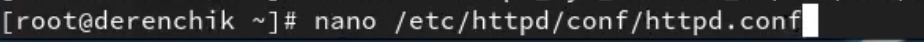{#fig:027 width=70%}

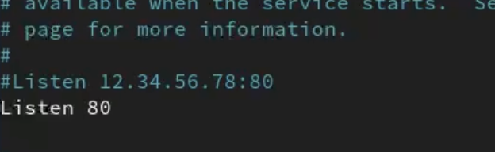{#fig:028 width=70%}

21) Удалим привязку http_port_t к 81 порту (рис. [-@fig:029]).

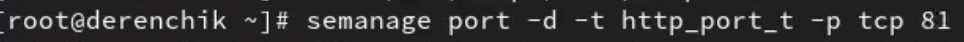{#fig:029 width=70%}

22) Удалим файл /var/www/html/test.html (рис. [-@fig:030]).

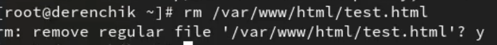{#fig:030 width=70%}

# Вывод

Я развил навыки администрирования ОС Linux, получил первое практическое знакомство с технологией SELinux и проверил работу SELinx на практике совместно с веб-сервером Apache.
