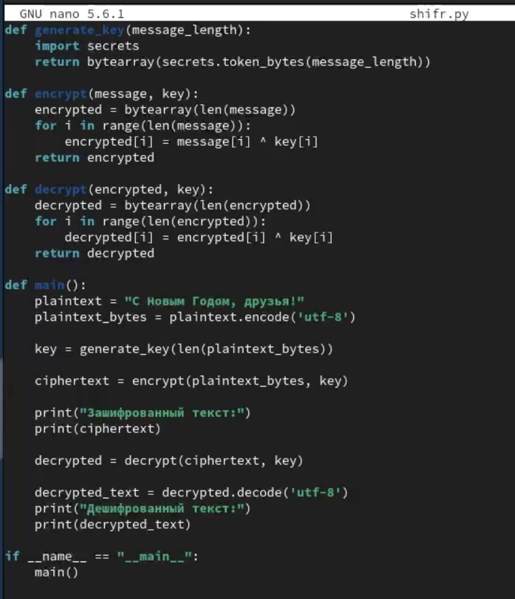
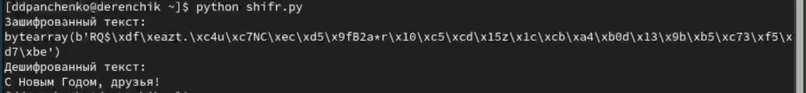

---
## Front matter
title: "Лабораторная работа №7"
subtitle: "Элементы криптографии. Однократное гаммирование"
author: "Панченко Денис Дмитриевич"

## Generic otions
lang: ru-RU
toc-title: "Содержание"

## Bibliography
bibliography: bib/cite.bib
csl: pandoc/csl/gost-r-7-0-5-2008-numeric.csl

## Pdf output format
toc: true # Table of contents
toc-depth: 2
lof: false # List of figures
lot: false # List of tables
fontsize: 12pt
linestretch: 1.5
papersize: a4
documentclass: scrreprt
## I18n polyglossia
polyglossia-lang:
  name: russian
  options:
	- spelling=modern
	- babelshorthands=true
polyglossia-otherlangs:
  name: english
## I18n babel
babel-lang: russian
babel-otherlangs: english
## Fonts
mainfont: PT Serif
romanfont: PT Serif
sansfont: PT Sans
monofont: PT Mono
mainfontoptions: Ligatures=TeX
romanfontoptions: Ligatures=TeX
sansfontoptions: Ligatures=TeX,Scale=MatchLowercase
monofontoptions: Scale=MatchLowercase,Scale=0.9
## Biblatex
biblatex: true
biblio-style: "gost-numeric"
biblatexoptions:
  - parentracker=true
  - backend=biber
  - hyperref=auto
  - language=auto
  - autolang=other*
  - citestyle=gost-numeric
## Pandoc-crossref LaTeX customization
figureTitle: "Рис."
tableTitle: "Таблица"
listingTitle: "Листинг"
lofTitle: "Список иллюстраций"
lotTitle: "Список таблиц"
lolTitle: "Листинги"
## Misc options
indent: true
header-includes:
  - \usepackage{indentfirst}
  - \usepackage{float} # keep figures where there are in the text
  - \floatplacement{figure}{H} # keep figures where there are in the text
---

# Цель работы

Освоить на практике применение режима однократного гаммирования.

# Задачи

* Научиться применять режим однократного гаммирования.

# Выполнение лабораторной работы

1) Создадим файл с программой (рис. [-@fig:001]).

{#fig:001 width=70%}

2) Напишем саму программу для шифрования (рис. [-@fig:002]).

{#fig:002 width=70%}

3) Выполним эту программу (рис. [-@fig:003]).

{#fig:003 width=70%}

# Контрольные вопросы

1. Поясните смысл однократного гаммирования.
Однократное гаммирование - это метод шифрования, при котором каждый символ открытого текста преобразуется путем выполнения операции XOR с соответствующим символом ключа. Этот метод получил свое название потому, что каждый ключ используется только один раз для шифрования определенного сообщения.

2. Перечислите недостатки однократного гаммирования.
- Необходимость в ключе такой же длины, как и открытый текст.
- Необходимость генерации случайного ключа для каждого сообщения.
- Уязвимость к атакам, основанным на повторном использовании ключа.
- Ограничение на размер сообщения из-за необходимости ключа такой же длины.

3. Перечислите преимущества однократного гаммирования.
- При правильной реализации и использовании случайного ключа является абсолютно надежным методом шифрования.
- Нельзя получить информацию о зашифрованном тексте без знания ключа.
- Сложность криптоанализа возрастает с увеличением размера ключа и текста.

4. Почему длина открытого текста должна совпадать с длиной ключа?
Поскольку для каждого символа открытого текста используется соответствующий символ ключа при операции XOR, длина ключа должна быть такой же, как и длина открытого текста, чтобы обеспечить правильное шифрование и дешифрование.

5. Какая операция используется в режиме однократного гаммирования, назовите её особенности?
В режиме однократного гаммирования используется операция XOR (побитовое сложение по модулю 2). Особенность этой операции заключается в том, что она возвращает true (1), если только один из операндов true (1), и false (0) в противном случае.

6. Как по открытому тексту и ключу получить шифротекст?
Шифротекст получается путем выполнения операции XOR между каждым символом открытого текста и соответствующим символом ключа.

7. Как по открытому тексту и шифротексту получить ключ?
Ключ получается путем выполнения операции XOR между каждым символом шифротекста и соответствующим символом открытого текста.

8. В чем заключаются необходимые и достаточные условия абсолютной стойкости шифра?
Необходимые и достаточные условия абсолютной стойкости шифра включают:
- Полная случайность ключа.
- Равенство длин ключа и открытого текста.
- Однократное использование ключа.

# Вывод

Я освоил на практике применение режима однократного гаммирования.
