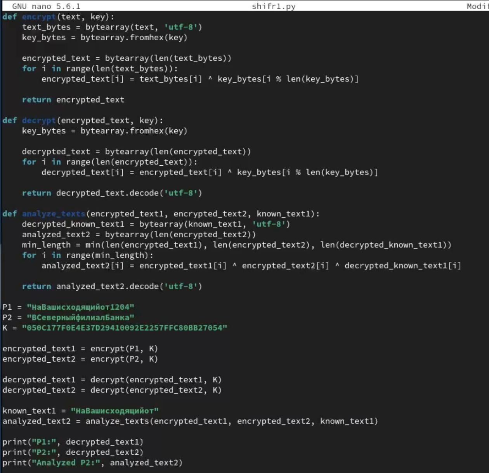
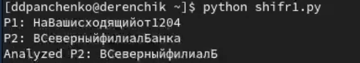

---
## Front matter
lang: ru-RU
title: Лабораторная работа 8
subtitle: Элементы криптографии. Шифрование (кодирование) различных исходных текстов одним ключом
author:
  - Панченко Д. Д.
institute:
  - Российский университет дружбы народов, Москва, Россия
date: 11 мая 2024

## i18n babel
babel-lang: russian
babel-otherlangs: english

## Formatting pdf
toc: false
toc-title: Содержание
slide_level: 2
aspectratio: 169
section-titles: true
theme: metropolis
header-includes:
 - \metroset{progressbar=frametitle,sectionpage=progressbar,numbering=fraction}
 - '\makeatletter'
 - '\beamer@ignorenonframefalse'
 - '\makeatother'
---

# Информация

## Докладчик

  * Панченко Денис Дмитриевич
  * Студент 2 курса факультета физико-математических наук.
  * Российский университет дружбы народов
  * [derenchikde@gmail.com](mailto:derenchikde@gmail.com)

## Цели и задачи

* Цель:
Освоить на практике применение режима однократного гаммирования на примере кодирования различных исходных текстов одним ключом.

* Задачи:
  * Научиться применять режим однократного гаммирования на примере кодирования различных исходных текстов одним ключом.

# Выполнение лабораторной работы

## Выполнение лабораторной работы

1) Создадим файл с программой.

## Выполнение лабораторной работы

2) Напишем саму программу для шифрования.

{width=70%}

## Выполнение лабораторной работы

3) Выполним эту программу.

# Вывод

Я освоил на практике применение режима однократного гаммирования на примере кодирования различных исходных текстов одним ключом.
