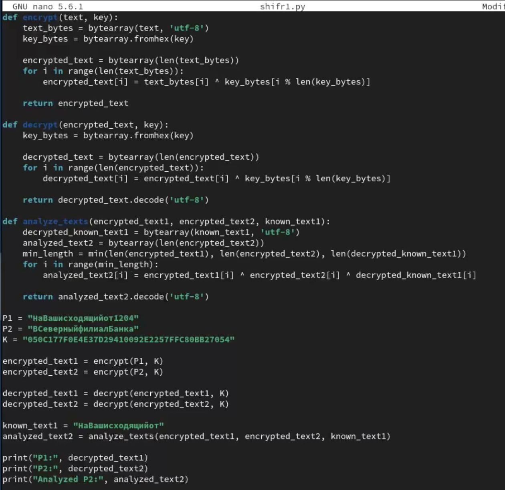
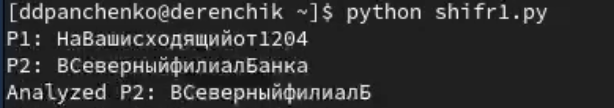

---
## Front matter
title: "Лабораторная работа №8"
subtitle: "Элементы криптографии. Шифрование (кодирование) различных исходных текстов одним ключом"
author: "Панченко Денис Дмитриевич"

## Generic otions
lang: ru-RU
toc-title: "Содержание"

## Bibliography
bibliography: bib/cite.bib
csl: pandoc/csl/gost-r-7-0-5-2008-numeric.csl

## Pdf output format
toc: true # Table of contents
toc-depth: 2
lof: false # List of figures
lot: false # List of tables
fontsize: 12pt
linestretch: 1.5
papersize: a4
documentclass: scrreprt
## I18n polyglossia
polyglossia-lang:
  name: russian
  options:
	- spelling=modern
	- babelshorthands=true
polyglossia-otherlangs:
  name: english
## I18n babel
babel-lang: russian
babel-otherlangs: english
## Fonts
mainfont: PT Serif
romanfont: PT Serif
sansfont: PT Sans
monofont: PT Mono
mainfontoptions: Ligatures=TeX
romanfontoptions: Ligatures=TeX
sansfontoptions: Ligatures=TeX,Scale=MatchLowercase
monofontoptions: Scale=MatchLowercase,Scale=0.9
## Biblatex
biblatex: true
biblio-style: "gost-numeric"
biblatexoptions:
  - parentracker=true
  - backend=biber
  - hyperref=auto
  - language=auto
  - autolang=other*
  - citestyle=gost-numeric
## Pandoc-crossref LaTeX customization
figureTitle: "Рис."
tableTitle: "Таблица"
listingTitle: "Листинг"
lofTitle: "Список иллюстраций"
lotTitle: "Список таблиц"
lolTitle: "Листинги"
## Misc options
indent: true
header-includes:
  - \usepackage{indentfirst}
  - \usepackage{float} # keep figures where there are in the text
  - \floatplacement{figure}{H} # keep figures where there are in the text
---

# Цель работы

Освоить на практике применение режима однократного гаммирования на примере кодирования различных исходных текстов одним ключом.

# Задачи

* Научиться применять режим однократного гаммирования на примере кодирования различных исходных текстов одним ключом.

# Выполнение лабораторной работы

1) Создадим файл с программой (рис. [-@fig:001]).

{#fig:001 width=70%}

2) Напишем саму программу для шифрования (рис. [-@fig:002]).

{#fig:002 width=70%}

3) Выполним эту программу (рис. [-@fig:003]).

{#fig:003 width=70%}

# Контрольные вопросы

1. Для определения другого текста (P2, например), зная один из текстов (P1) без знания ключа, можно использовать аналитический метод, основанный на операции XOR. Если у вас есть шифротексты обоих сообщений, то можно применить операцию XOR между шифротекстами. Это даст вам результат, который, когда применен к P1, даст P2. Таким образом, можно получить P2, не зная ключа.

2. При повторном использовании ключа при шифровании текста в режиме однократного гаммирования тексты будут зашифрованы одним и тем же способом. Это значит, что при повторном использовании ключа для разных открытых текстов может возникнуть возможность провести атаку на шифротекст, используя известные свойства открытых текстов и операции XOR.

3. Режим шифрования однократного гаммирования одним ключом двух открытых текстов осуществляется путем применения операции XOR между каждым байтом открытого текста и соответствующим байтом ключа. То есть, каждый байт открытого текста складывается по модулю 2 (XOR) с соответствующим байтом ключа.

4. Недостатки шифрования одним ключом двух открытых текстов:
- При повторном использовании ключа может возникнуть уязвимость из-за возможности атаки на шифротекст, основанной на известных открытых текстах и операции XOR.
- Сложность в управлении ключами и обеспечении их безопасного обмена, особенно если требуется использовать разные ключи для разных текстов.

5. Преимущества шифрования одним ключом двух открытых текстов:
- Экономия на вычислительных ресурсах и объеме ключа, так как для шифрования используется один ключ для двух текстов.
- Удобство при передаче и хранении ключа, так как требуется только один ключ для обоих текстов.
- Возможность эффективного использования аналитических методов для расшифровки сообщений при наличии информации об одном из открытых текстов.

# Вывод

Я освоил на практике применение режима однократного гаммирования на примере кодирования различных исходных текстов одним ключом.
