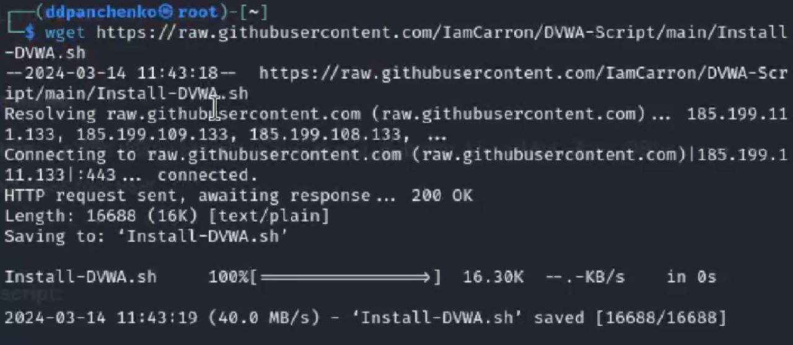
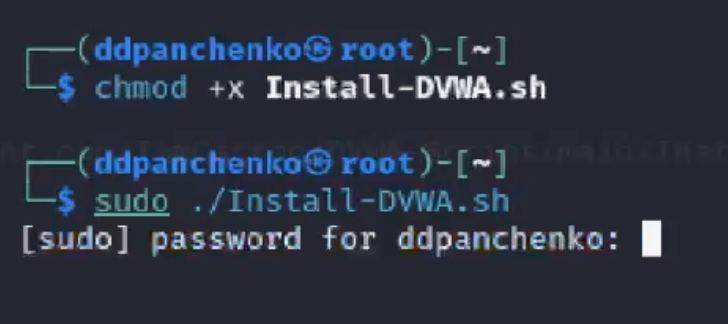

---
## Front matter
lang: ru-RU
title: Индивидуальный проект
subtitle: Установка DVWA
author:
  - Панченко Д. Д.
institute:
  - Российский университет дружбы народов, Москва, Россия
date: 15 марта 2024

## i18n babel
babel-lang: russian
babel-otherlangs: english

## Formatting pdf
toc: false
toc-title: Содержание
slide_level: 2
aspectratio: 169
section-titles: true
theme: metropolis
header-includes:
 - \metroset{progressbar=frametitle,sectionpage=progressbar,numbering=fraction}
 - '\makeatletter'
 - '\beamer@ignorenonframefalse'
 - '\makeatother'
---

# Информация

## Докладчик

  * Панченко Денис Дмитриевич
  * Студент 2 курса факультета физико-математических наук.
  * Российский университет дружбы народов
  * [derenchikde@gmail.com](mailto:derenchikde@gmail.com)

## Цели и задачи

Установить GVWA в гостевую систему к Kali Linux.

## Задание

Установить GVWA в гостевую систему к Kali Linux.

# Выполнение лабораторной работы

## Устанавливаем файлы из репозитория в GitHub.

## Устанавливаем DVWA из репозитория.

## DVWA установлен.

# Вывод

Я установил DVWA в гостевую систему к Kali Linux.
