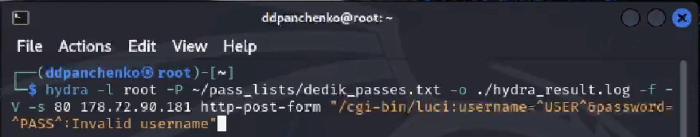

---
## Front matter
lang: ru-RU
title: Индивидуальный проект
subtitle: Использование Hydra
author:
  - Панченко Д. Д.
institute:
  - Российский университет дружбы народов, Москва, Россия
date: 6 апреля 2024

## i18n babel
babel-lang: russian
babel-otherlangs: english

## Formatting pdf
toc: false
toc-title: Содержание
slide_level: 2
aspectratio: 169
section-titles: true
theme: metropolis
header-includes:
 - \metroset{progressbar=frametitle,sectionpage=progressbar,numbering=fraction}
 - '\makeatletter'
 - '\beamer@ignorenonframefalse'
 - '\makeatother'
---

# Информация

## Докладчик

  * Панченко Денис Дмитриевич
  * Студент 2 курса факультета физико-математических наук.
  * Российский университет дружбы народов
  * [derenchikde@gmail.com](mailto:derenchikde@gmail.com)

## Цели и задачи

Научиться пользоваться Hydra в системе Kali Linux.

## Задание

Научиться пользоваться Hydra в системе Kali Linux.

# Выполнение лабораторной работы

##

Hydra используется для подбора или взлома имени пользователя и пароля.
Поддерживает подбор для большого набора приложений.

Исходные данные:
IP сервера 178.72.90.181;
Сервис http на стандартном 80 порту;
Для авторизации используется html форма, которая отправляет по адресу http://178.72.90.181/cgi-bin/luci методом POST запрос вида username=root&password=test_password;

## Выполняем запрос к Hydra.

# Вывод

Я научился использовать Hydra в Kali Linux.
